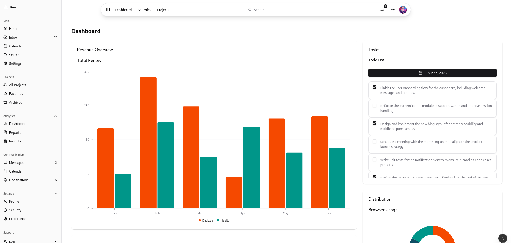

# Shadcn UI Component Showcase

> **Note:** This project is actively being worked on.

<p align="center">
  
</p>

A demonstration project showcasing the capabilities and potential of [Shadcn UI](https://ui.shadcn.com/) components. This project serves as a visual playground and reference for implementing various UI patterns using Shadcn UI components.

## 🎯 Purpose

This project demonstrates:

- How to implement various UI patterns using Shadcn UI
- Component composition and customization
- Theme integration and dark mode implementation
- Layout patterns and responsive design
- Data visualization possibilities
- Form handling and validation
- Interactive components and animations

## 🛠️ Components Demonstrated

### Layout & Navigation

- Responsive sidebar with collapsible sections
- Floating transparent navbar with blur effect
- Breadcrumb navigation
- Dropdown menus
- User profile menu

### Data Display

- Cards with various layouts
- Tables with sorting and pagination
- Lists with badges and icons
- Progress indicators
- Avatar components
- Badges and status indicators

### Data Visualization

- Line charts (using Recharts)
- Bar charts
- Pie charts
- Area charts

### Forms & Input

- Text inputs
- Dropdowns
- Checkboxes
- Date pickers
- Form validation with Zod

### Interactive Elements

- Hover cards
- Tooltips
- Popovers
- Modals
- Sheets (slide-out panels)
- Collapsible sections

## 🎨 Theme & Styling

The project demonstrates:

- Dark/light mode implementation
- Custom color schemes
- Responsive design patterns
- Animation and transition effects
- Glassmorphism effects
- Modern UI patterns

## 🚀 Getting Started

1. Clone the repository:

```bash
git clone https://github.com/adithpv/shadcn-project.git
cd shadcn-project
```

2. Install dependencies:

```bash
npm install
# or
yarn install
# or
pnpm install
# or
bun install
```

3. Run the development server:

```bash
npm run dev
# or
yarn dev
# or
pnpm dev
# or
bun dev
```

4. Open [http://localhost:3000](http://localhost:3000) to explore the components.

## 🎯 Learning Resources

- [Shadcn UI Documentation](https://ui.shadcn.com/docs)
- [Next.js Documentation](https://nextjs.org/docs)
- [Tailwind CSS Documentation](https://tailwindcss.com/docs)
- [Radix UI Documentation](https://www.radix-ui.com/docs)

## 🎯 Key Takeaways

This project serves as a reference for:

- Component composition patterns
- Theme customization
- Responsive design implementation
- Modern UI/UX patterns
- Best practices for using Shadcn UI

## ⚠️ Note

This is a demonstration project using dummy data. It's meant to showcase UI patterns and component usage rather than actual functionality. The data shown in charts, tables, and lists is static and for display purposes only.

## 🛠️ Built With

- [Next.js](https://nextjs.org/) - React framework
- [Shadcn UI](https://ui.shadcn.com/) - UI components
- [Tailwind CSS](https://tailwindcss.com/) - Styling
- [TypeScript](https://www.typescriptlang.org/) - Type safety
- [Recharts](https://recharts.org/) - Charts
- [Lucide Icons](https://lucide.dev/) - Icons
- [Radix UI](https://www.radix-ui.com/) - Primitives

## 🤝 Contributing

Feel free to:

- Report bugs
- Suggest new features
- Submit pull requests
- Share your own component implementations

Built with ❤️ using [Shadcn UI](https://ui.shadcn.com/)
